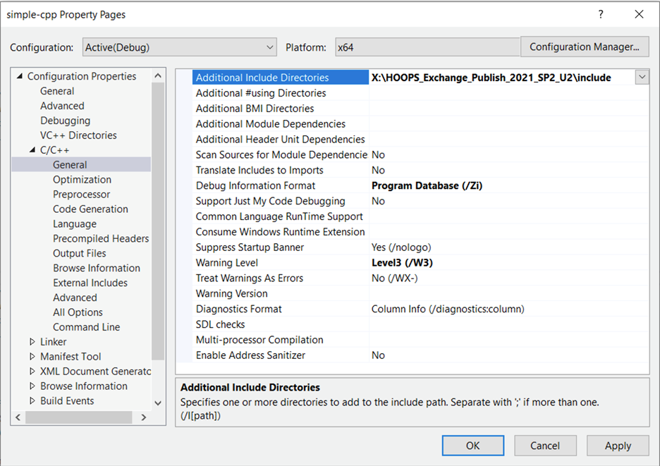

# Print the Assembly Structure

Learn to create a basic application that uses HOOPS Exchange to print the assembly structure of an input file.

## Introduction

This tutorial will walk you through the fundamentals of writing a console application with HOOPS Exchange.
After completion of this tutorial, you should have enough understanding of the technology to start integrating HOOPS Exchange into your application.

The prerequisite for this tutorial is a basic understanding of C/C++ application development.
You should begin this tutorial with an IDE configured to build and run a basic "hello world" sample application.
No advanced CAD expertise or GUI development skills are required.

The completed project will load a specified input file and print the assembly structure to `stdout`.

## Build with HOOPS Exchange

In this section, you will learn how to add HOOPS Exchange to the build system.

To build with HOOPS Exchange, we must add the include folder to the search path.
On macOS and Linux, we must also add the dynamic linker library ‘dl‘.

### Add the Include Folder

Windows users should edit the project properties in Visual Studio and add the include folder using in the C/C++ pane.



If you are using `cmake`, edit `CMakeLists.txt` and add the following line to the file:

```
include_directories(/opt/ts3d/HOOPS_Exchange_Publish_2021_SP2_U2/include)
```

NOTE: The argument should specify the location of **your** installation of HOOPS Exchange.

### Add the Dynamic Linker (macOS and Linux only)

If you are using `cmake` edit `CMakeLists.txt` and add the following line to the file:

```
target_link_libraries(he_basic_app -ldl)
```

Here is a complete file that can serve as an easy starting point for your `CMakeLists.txt.`

```
cmake_minimum_required(VERSION 3.0.0)
project(he_basic_app VERSION 0.1.0)

include(CTest)
enable_testing()

add_executable(he_basic_app main.cpp)

set(CPACK_PROJECT_NAME ${PROJECT_NAME})
set(CPACK_PROJECT_VERSION ${PROJECT_VERSION})
include(CPack)
if(WIN32)
    include_directories(X:/HOOPS_Exchange_Publish_2021_SP2_U2/include)
else()
    include_directories(/opt/local/ts3d/HOOPS_Exchange_2021_SP2_U2/include)
    add_link_options(he_basic_app -ldl)
endif(WIN32)
```

### Build and Run

As a sanity check, remember to build and run!

## Include HOOPS Exchange

In this section, you will learn how to properly include HOOPS Exchange in your source code.

To use the HOOPS Exchange API, you must include its header.
This all-inclusive header provides you access to the entire toolkit.
Open _main.cpp_ in your IDE‘s editor.
Add the following line to the top of the file at line 1.

```
##include <A3DSDKIncludes.h>
```

After adding this line, you should be able to build and run if you‘ve specified the include path correctly in the previous section.

To properly initialize HOOPS Exchange, **one** of compilation units in your application must declare a preprocessor macro prior to including the header above.
By doing adding this preprocessor definition, you are enabling the code that creates the global instance of the API itself.
Add the following line just before you include the Exchange header.

```
#define INITIALIZE_A3D_API
#include <A3DSDKIncludes.h>
```

Remember, this preprocessor definition should be present in only one of your compilation units.
If multiple compilation units contain the definition, you will encounter duplicate symbols at link time.
Since our project only contains a single compilation unit (_main.cpp_) this won‘t be a problem, but you should be aware of this when integrating HOOPS Exchange into your own application.

Now is probably a good time to build and run the project as you‘ve done before.

## Initializing HOOPS Exchange

In this section, you will learn how to initialize the HOOPS Exchange library.
We‘ll also cover the functions used to tear it down after use.

### Load the Libraries

The first step is to load the dynamic libraries into memory and initialize all the API function pointers to their corresponding implementations.
Sounds complicated, right? Luckily, this is done by simply invoking a function.
Add the following lines of code inside of main.

```
A3DBool const is_loaded = A3DSDKLoadLibraryA("X:/HOOPS_Exchange_Publish_2021_SP2_U2/bin/win64_v140");
if( !is_loaded ) {
  std::cerr << "Unable to load HOOPS Exchange." << std::endl;
  return -1;
} else {
  std::cout << "Loaded." << std::endl;
}
```

Make sure the path you specify as the argument matches the specifics of your installation and platform.
We will keep good on our promise to unload the libraries when we‘re finished.
Easily done- just add this line before you return _0_.

```
A3DSDKUnloadLibrary();
return 0;
```

Build and run. Still good?

### Provide the License

To unlock the HOOPS Exchange toolkit, you must use a license string.
Your license string should be kept secret.
The license string you‘ll use is in a file called _hoops_license.h_ in the HOOPS Exchange include folder.
Verify it is present.

Include the license file header by adding the following line at the top of the file.

```
#include <hoops_license.h>
```

Use the API to unlock HOOPS Exchange by adding the following lines of code after the library loading functionality you just added.

```
A3DStatus const license_status = A3DLicPutUnifiedLicense( HOOPS_LICENSE );
if( A3D_SUCCESS != license_status ) {
  std::cerr << "Unable to license HOOPS Exchange." << std::endl;
  std::cerr << "Status: " << A3DMiscGetErrorMsg( license_status ) <<
  std::endl;
  return -1;
} else {
  std::cout << "Licensed." << std::endl;
}
```

If you accidentally added this code after you‘ve unloaded the library, you‘ll run into issues.
_HOOPS_LICENSE_ is a preprocessor definition contained withing _hoops_license.h_.
It is a long string containing your license key.

You can now verify that your license is present and in good working order by running the code as it is.
If all is well, you should see the message "Licensed." on stdout.

### Initialize HOOPS Exchange

The final step allows HOOPS Exchange to perform initialization of its internal state.
Additionally, this function checks to ensure the version numbers declared in the Exchange headers you‘ve included are a match with those baked into the dynamic library.
Here are the lines of code to add.

```
A3DStatus const init_status = A3DDllInitialize( A3D_DLL_MAJORVERSION, A3D_DLL_MINORVERSION );
if( A3D_SUCCESS != init_status ) {
  std::cerr << "Unable to initialize HOOPS Exchange." << std::endl;
  std::cerr << "Status: " << A3DMiscGetErrorMsg( init_status ) <<
  std::endl;
  return -1;
} else {
  std::cout << "Ready for use." << std::endl;
}

// Use Exchange here

A3DDllTerminate();
A3DSDKUnloadLibrary();
return 0;
```

And that‘s really all that‘s to it.
If you found this too laborious and it suits your usage, you could instead use the class `A3DSDKHOOPSExchangeLoader`.
It implements all this functionality internally.
The only caveat is that the lifetime of the object you declare must match or exceed your use of any Exchange API.
If you go this route, our entire program becomes the following.

```
int main(int, char**) {
  A3DSDKHOOPSExchangeLoader
  loader(L"X:/HOOPS_Exchange_Publish_2021_SP2_U2/bin/win64_v140");
  if( ! loader.m_bSDKLoaded ) {
    std::cerr << "Unable to load HOOPS Exchange." << std::endl;
    std::cerr << "Status: " << A3DMiscGetErrorMsg(loader.m_eSDKStatus) <<
    std::endl;
    return -1;
  }
  std::cout << "Ready for use." << std::endl;
  return 0;
}
```

This is easier.
Just remember to be careful managing the lifetime of the loader object.
We can stick with the simpler implementation for the tutorial.
On macOS and Linux, ditch the "L" that precedes the argument.

Now you know all about how HOOPS Exchange is initialized.
If something should go wrong with it, you‘re in a great position to reason out the cause.

## Load a File

In this section you will learn the most basic way to load a file using HOOPS Exchange.
To achieve this goal, you will first declare and initialize loading options.
The loading options are used by the loading API which returns a handle to the loaded file.

### Configure Loading Options

The API we‘ll use to load an input file accepts an options structure that controls its behavior.
Since the objective is to simply load a file and print the assembly structure, the default options will do just fine.

Declare the options structure and initialize it using the following code.
We‘ll describe this code in more detail later.

```
A3DRWParamsLoadData load_params;
A3D_INITIALIZE_DATA( A3DRWParamsLoadData, load_params );
```

Next, we need a variable to hold the resulting model file handle.

```
A3DAsmModelFile *model_file = nullptr;
```

This declares an opaque handle used to reference the data associated with the file you‘ve just loaded.
You‘ll learn how to access the data shortly.

And finally, we can call the Exchange function that loads a file.
Please note the hard coded file path to an input file here.
You should at least change this to your installation‘s path, but you can point it at any file you‘d like, provided the [format is supported](overview.html) by HOOPS Exchange.

```
auto const input_file = "X:/HOOPS_Exchange_2021_SP2_U2/samples/data/prc/__drill.prc";
A3DStatus load_status = A3DAsmModelFileLoadFromFile( input_file, &load_params, &model_file );
if( A3D_SUCCESS != load_status ) {
  std::cerr << "Unable to load the specified file: " << input_file <<
  std::endl;
  std::cerr << "Status: " << A3DMiscGetErrorMsg( load_status ) <<
  std::endl;
  return -1;
  } else {
  std::cout << "Loaded file: " << input_file << std::endl;
}
```

Let‘s be good citizens and clean up after ourselves.
Assume there is some usage of the model file, and when we‘re finished it should be cleaned up just before the program exits.

```
A3DAsmModelFileDelete( model_file );
model_file = nullptr;
return 0;
```

When you build and run the code you have at this point, you‘ll have the code and the understanding of how to load any of the supported file formats using the HOOPS Exchange toolkit.
You should see a message written to stdout proclaiming the fail has been loaded.

## Getting an Exchange Entity‘s Name

In this section, you will learn how to extract data from the HOOPS Exchange API so you can use it in your application.
You will also learn the fundamental usage pattern for all data retrieval from Exchange.

Let‘s print the model file object‘s name to `stdout`.
Create a function above main as follows:

```
#include <string>
std::string getName( A3DEntity *ntt ) {
  return std::string();
}
```

`A3DEntity` is a generic handle type that can be used to reference any object in Exchange.
We‘ll be using the fact that every object in Exchange has a common set of base data available through the A3DRootBase interface.

### Declare and Initialize the Storage

HOOPS Exchange uses C-style structs to read from (and write into) its internal data representation.
Before we read data, we must declare a struct of the appropriate type to hold the result.
The struct must be initialized using a macro prior to its use.
Among other possible things, the initialization macro sets the `m_usStructSize` field, which serves as a check internally.
Inside the function you just stubbed out, add the following lines of code.

```
std::string name;
A3DRootBaseData rbd;
A3D_INITIALIZE_DATA( A3DRootBaseData, rbd );
```

### Read the Data

The pattern that follows is pervasive when using the HOOPS Exchange API.
Any time you read data you must be sure to make a corresponding call to free it.
This pattern looks something like this.

```
if( A3D_SUCCESS == A3DRootBaseGet( ntt, &rbd ) ) {
  name = rbd.m_pcName ? rbd.m_pcName : "";
}
A3DRootBaseGet( nullptr, &rbd );
```

You can avoid the initialization and use pattern with wrapper objects found [here](https://github.com/techsoft3d/ExchangeToolkit).
We‘ll stick to the more purist approach for the purposes of this tutorial.

Once complete, your function should look like this:

```
#include <string>
std::string getName( A3DEntity *ntt ) {
  std::string name;
  A3DRootBaseData rbd;
  A3D_INITIALIZE_DATA( A3DRootBaseData, rbd );
  if( A3D_SUCCESS == A3DRootBaseGet( ntt, &rbd ) ) {
    name = rbd.m_pcName ? rbd.m_pcName : "";
  }
  A3DRootBaseGet( nullptr, &rbd );
  return name;
}
```

### Print the Name

Back in main, add the following line of code after the model file is successfully loaded.

```
std::cout << getName( model_file ) << std::endl;
```

The functionality we wrote here will certainly come in handy as we iterate over the assembly structure.

### Build and Run

Take the time to build and run the code you‘ve just added.
In addition to the message indicating the file was loaded, you should now see the model file object‘s name printed to stdout.

## Traverse the Assembly

In this section, you will learn about the Exchange object responsible for representing the assembly structure within a model file.
You will also learn an common approach for traversing the structure.

### Recursive Structure

In HOOPS Exchange, the object type used to represent a node in the assembly structure is `A3DAsmProductOccurrence`.
A model file contains a collection of one or more (but usually just one) "root nodes", which are product occurrences.

Each product occurrence object can itself contain a collection of one or more nodes, which are also product occurrence objects.
Thus, we have a recursive structure used to represent the assembly hierarchy from a model file.

In addition to possibly owning a collection of assembly nodes, a product occurrence can contain a part.

Let‘s employ all the previously laid groundwork to write a recursive function that traverses the assembly structure and prints the node‘s name.
Create the following function just above main, below `getName`.

```
void traverse( A3DAsmProductOccurrence *po, int indent = 1) {
  if( nullptr == po ) {
    return;
  }
  std::cout << std::string( 2*indent, ' ' ) << getName( po ) << std::endl;
  A3DAsmProductOccurrenceData pd;
  A3D_INITIALIZE_DATA( A3DAsmProductOccurrenceData, pd );
  if( A3D_SUCCESS == A3DAsmProductOccurrenceGet( po, &pd ) ) {
    for(A3DUns32 idx = 0u; idx < pd.m_uiPOccurrencesSize; ++idx ) {
      traverse( pd.m_ppPOccurrences[idx], indent + 1 );
    }
  }
  A3DAsmProductOccurrenceGet( nullptr, &pd );
}
```

# Final Step

With this function now in place, we can modify the main function body to use it.
Recall we have a model file object, so we must retrieve its contents and iterate over the collection of root assembly nodes.
For each root node, we‘ll invoke traverse.

```
A3DAsmModelFileData mfd;
A3D_INITIALIZE_DATA( A3DAsmModelFileData, mfd );
if( A3D_SUCCESS == A3DAsmModelFileGet( model_file, &mfd ) ) {
  for( A3DUns32 idx = 0u; idx < mfd.m_uiPOccurrencesSize; ++idx ) {
    traverse( mfd.m_ppPOccurrences[idx] );
  }
}
A3DAsmModelFileGet( nullptr, &mfd );
```

Build and run the application and see that we‘ve accomplished the goal we set out to achieve.
Your output should look something like this:

```
Ready for use.
Loaded file:
X:/HOOPS_Exchange_2021_SP2_U2/samples/data/prc/__drill.prc
__drill
        __drill
        ENGINE
                ENG_BLOCK_REAR
                ENG_BEARING
                ENG_BLOCK_FRONT
                ENG_BEARING
                CYLINDER
                BOLT_5-18<BOLT>
                BOLT_5-18<BOLT>
                BOLT_5-28<BOLT>
                BOLT_5-28<BOLT>
                BOLT_5-28<BOLT>
                CRANK
                        CRANKSHAFT
                        FLYWHEEL
```

## Conclusion

You have learned a huge amount by completing this tutorial.
You have laid foundational skills that will be useful throughout your use of HOOPS Exchange.

The completed code you have should resemble this:

```
#define INITIALIZE_A3D_API
#include <A3DSDKIncludes.h>
#include <iostream>
#include <string>

std::string getName( A3DEntity *ntt ) {
    std::string name;
    A3DRootBaseData rbd;
    A3D_INITIALIZE_DATA( A3DRootBaseData, rbd );
    if( A3D_SUCCESS == A3DRootBaseGet( ntt, &rbd ) ) {
        name = rbd.m_pcName ? rbd.m_pcName : "";
    }
    A3DRootBaseGet( nullptr, &rbd );
    return name;
}

void traverse( A3DAsmProductOccurrence *po, int indent = 1) {
    if( nullptr == po ) {
        return;
    }

    std::cout << std::string( 2*indent, ' ' ) << getName( po ) << std::endl;

    A3DAsmProductOccurrenceData pd;
    A3D_INITIALIZE_DATA( A3DAsmProductOccurrenceData, pd );
    if( A3D_SUCCESS == A3DAsmProductOccurrenceGet( po, &pd ) ) {
        for(A3DUns32 idx = 0u; idx < pd.m_uiPOccurrencesSize; ++idx ) {
            traverse( pd.m_ppPOccurrences[idx], indent + 1 );
        }
    }
    A3DAsmProductOccurrenceGet( nullptr, &pd );
}

int main(int, char**) {
    A3DSDKHOOPSExchangeLoader loader("X:/HOOPS_Exchange_Publish_2021_SP2_U2/bin/win64_v140");
    if( ! loader.m_bSDKLoaded ) {
        std::cerr << "Unable to load HOOPS Exchange." << std::endl;
        std::cerr << "Status: " << A3DMiscGetErrorMsg(loader.m_eSDKStatus) << std::endl;
        return -1;
    }

    std::cout << "Ready for use." << std::endl;

    A3DRWParamsLoadData load_params;
    A3D_INITIALIZE_DATA( A3DRWParamsLoadData, load_params );
    A3DAsmModelFile *model_file = nullptr;
    char const *input_file =
        "X:/HOOPS_Exchange_2021_SP2_U2/samples/data/prc/__drill.prc";
    A3DStatus load_status = A3DAsmModelFileLoadFromFile( input_file, &load_params, &model_file );
    if( A3D_SUCCESS != load_status ) {
        std::cerr << "Unable to load the specified file: " << input_file << std::endl;
        std::cerr << "Status: " << A3DMiscGetErrorMsg( load_status ) << std::endl;
        return -1;
    } else {
        std::cout << "Loaded file: " << input_file << std::endl;
    }

    std::cout << getName( model_file ) << std::endl;

    A3DAsmModelFileData mfd;
    A3D_INITIALIZE_DATA( A3DAsmModelFileData, mfd );
    if( A3D_SUCCESS == A3DAsmModelFileGet( model_file, &mfd ) ) {
        for( A3DUns32 idx = 0u; idx < mfd.m_uiPOccurrencesSize; ++idx ) {
            traverse( mfd.m_ppPOccurrences[idx] );
        }
    }
    A3DAsmModelFileGet( nullptr, &mfd );

    A3DAsmModelFileDelete( model_file );
    model_file = nullptr;
    return 0;
}
```

<div id="autoExpand">
    <span>top_level:0</span>
</div>

*/
